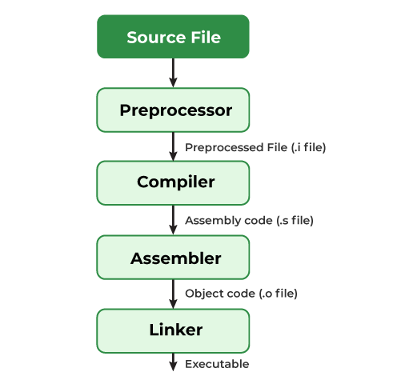

# C-Ocean

# About C Language

C is a versatile and efficient programming language widely used for system-level programming, operating systems, and performance-critical applications. It offers low-level memory access and portability across platforms.

# Compilation Process

The C compilation process transforms source code into an executable file. Below is a simplified diagram:

[Compination Process Image](image.png)

### Key Steps:
| Step            | Description                                                                 |
|------------------|-----------------------------------------------------------------------------|
| **Preprocessing** | Processes directives like `#include` and `#define`.                       |
| **Compilation**   | Converts preprocessed code to assembly code.                              |
| **Assembly**      | Translates assembly code into machine-readable object files.              |
| **Linking**       | Combines object files and libraries into a final executable.              |

This streamlined process ensures efficient execution of C programs.

# Data Types in C

C provides a variety of data types to handle different kinds of data. These data types define the type of data a variable can hold and the operations that can be performed on it.

## Primary Data Types
| Data Type | Description                                      | Example                     |
|-----------|--------------------------------------------------|-----------------------------|
| **int**   | Used to store integers.                         | `int age = 25;`            |
| **float** | Used to store single-precision floating-point numbers. | `float pi = 3.14;`         |
| **double**| Used to store double-precision floating-point numbers. | `double distance = 12345.678;` |
| **char**  | Used to store single characters.                | `char grade = 'A';`        |

## Derived Data Types
| Data Type   | Description                                                   | Example                              |
|-------------|---------------------------------------------------------------|--------------------------------------|
| **Arrays**  | Collection of elements of the same type.                      | `int numbers[5];`                   |
| **Pointers**| Variables that store memory addresses.                        | `int *ptr;`                         |
| **Structures** | User-defined data types that group variables of different types. | `struct Person { char name[50]; int age; };` |
| **Unions**  | Similar to structures but share memory among members.         | `union Data { int i; float f; };`   |

## Enumeration
| Data Type | Description                                      | Example                     |
|-----------|--------------------------------------------------|-----------------------------|
| **enum**  | Used to define a set of named integer constants. | `enum Color { RED, GREEN, BLUE };` |

## Void Type
| Data Type | Description                                      | Example                     |
|-----------|--------------------------------------------------|-----------------------------|
| **void**  | Represents the absence of a value, often used for functions that do not return anything. | `void display();`          |

Understanding these data types is fundamental to writing efficient and error-free C programs.

# Size of Data Types in C

The size of data types in C can vary depending on the system architecture (e.g., 32-bit or 64-bit). Below are the typical sizes for common data types:

## Primary Data Types
| Data Type | Typical Size (32-bit) | Typical Size (64-bit) |
|-----------|------------------------|------------------------|
| **int**   | 4 bytes (32 bits)      | 4 bytes (32 bits)      |
| **float** | 4 bytes (32 bits)      | 4 bytes (32 bits)      |
| **double**| 8 bytes (64 bits)      | 8 bytes (64 bits)      |
| **char**  | 1 byte (8 bits)        | 1 byte (8 bits)        |

## Derived Data Types
| Data Type   | Size Description                                                                 |
|-------------|----------------------------------------------------------------------------------|
| **Arrays**  | Size depends on the number of elements and the size of the element type.         |
| **Pointers**| Typically 4 bytes on a 32-bit system and 8 bytes on a 64-bit system.             |
| **Structures** | Size depends on the sum of the sizes of its members, with possible padding for alignment. |
| **Unions**  | Size is equal to the size of its largest member.                                 |

## Enumeration
| Data Type | Typical Size |
|-----------|--------------|
| **enum**  | Typically the same size as `int` (4 bytes). |

## Void Type
| Data Type | Size Description |
|-----------|------------------|
| **void**  | Does not occupy any memory. |

These sizes are system-dependent and can be checked using the `sizeof` operator in C.

# Format Specifiers in C

Format specifiers are used in C to define the type of data being input or output. They are essential when using functions like `printf` and `scanf`.

## Common Format Specifiers
| Data Type       | Format Specifier | Example Usage                     |
|------------------|------------------|-----------------------------------|
| **int**         | `%d` or `%i`     | `printf("Age: %d", age);`         |
| **float**       | `%f`             | `printf("PI: %f", pi);`           |
| **double**      | `%lf`            | `printf("Distance: %lf", distance);` |
| **char**        | `%c`             | `printf("Grade: %c", grade);`     |
| **string**      | `%s`             | `printf("Name: %s", name);`       |
| **unsigned int**| `%u`             | `printf("Count: %u", count);`     |
| **long int**    | `%ld`            | `printf("Large Number: %ld", num);` |
| **long long int**| `%lld`          | `printf("Very Large Number: %lld", num);` |
| **unsigned long int** | `%lu`      | `printf("Unsigned Long: %lu", num);` |
| **unsigned long long int** | `%llu`| `printf("Unsigned Very Long: %llu", num);` |
| **hexadecimal** | `%x` or `%X`     | `printf("Hex: %x", value);`       |
| **octal**       | `%o`             | `printf("Octal: %o", value);`     |
| **pointer**     | `%p`             | `printf("Address: %p", ptr);`     |

## Notes:
- `%f` can also be used for `float` values, but for higher precision, `%lf` is used for `double`.
- `%x` outputs hexadecimal in lowercase, while `%X` outputs it in uppercase.
- Always ensure the format specifier matches the data type to avoid undefined behavior.

Understanding format specifiers is crucial for effective input and output operations in C programs.

# Signed and Unsigned Data Types in C

In C, data types can be either **signed** or **unsigned**, which determines whether they can represent negative values.

## Signed Data Types
- **Signed** data types can store both positive and negative values.
- By default, most data types in C are signed.

## Unsigned Data Types
- **Unsigned** data types can only store non-negative values (0 and positive numbers).
- They provide a larger range of positive values compared to their signed counterparts.

## Formula to Calculate Range
For a data type with `n` bits:
- **Signed Range**: `-(2^(n-1))` to `(2^(n-1)) - 1`
- **Unsigned Range**: `0` to `(2^n) - 1`

## Range of Common Data Types
| Data Type         | Size (in bits) | Signed Range                       | Unsigned Range                  |
|--------------------|----------------|-------------------------------------|----------------------------------|
| **char**          | 8              | `-128` to `127`                    | `0` to `255`                    |
| **short int**      | 16             | `-32,768` to `32,767`              | `0` to `65,535`                 |
| **int**           | 32             | `-2,147,483,648` to `2,147,483,647`| `0` to `4,294,967,295`          |
| **long int**       | 32             | `-2,147,483,648` to `2,147,483,647`| `0` to `4,294,967,295`          |
| **long long int**  | 64             | `-9,223,372,036,854,775,808` to `9,223,372,036,854,775,807` | `0` to `18,446,744,073,709,551,615` |
| **float**          | 32             | N/A (depends on IEEE 754 standard) | N/A                              |
| **double**         | 64             | N/A (depends on IEEE 754 standard) | N/A                              |

## Notes:
- The ranges for floating-point types (`float` and `double`) depend on the IEEE 754 standard and are not calculated using the above formula.
- Always use the `sizeof` operator to confirm the size of a data type on your specific system.

Understanding signed and unsigned types is essential for selecting the appropriate data type for your application and avoiding overflow or underflow errors.

# ASCII Values in C

ASCII (American Standard Code for Information Interchange) is a character encoding standard that assigns a unique numerical value to each character, including letters, digits, punctuation marks, and control characters. These numerical values are known as ASCII values.

## ASCII Table Overview
- ASCII values range from 0 to 127.
- Characters like `A`, `B`, `C`, etc., have corresponding ASCII values (e.g., `A` is 65, `B` is 66).
- Control characters like newline (`\n`) and tab (`\t`) also have ASCII values.

## Example of ASCII Values in C
Below is a simple example to demonstrate how ASCII values work in C:

```c
#include <stdio.h>

int main() {
    char character = 'A'; // Character to find ASCII value
    int asciiValue = character; // Implicit conversion to int

    printf("The ASCII value of '%c' is %d\n", character, asciiValue);

    // Loop through characters
    printf("ASCII values of characters from 'A' to 'Z':\n");
    for (char ch = 'A'; ch <= 'Z'; ch++) {
        printf("'%c': %d\n", ch, ch);
    }

    return 0;
}
```

### Output:
```
The ASCII value of 'A' is 65
ASCII values of characters from 'A' to 'Z':
'A': 65
'B': 66
'C': 67
...
'Z': 90
```

## Explanation
1. **Character to ASCII Conversion**: In C, characters are internally stored as integers. Assigning a character to an integer variable or using it in an arithmetic operation automatically converts it to its ASCII value.
2. **Looping Through Characters**: You can iterate through characters using a loop, as they are sequentially ordered in the ASCII table.

## Practical Use Cases
- **Character Manipulation**: Convert between uppercase and lowercase using ASCII arithmetic:
  ```c
  char upper = 'A';
  char lower = upper + 32; // 'a' is 32 positions after 'A' in ASCII
  printf("Lowercase of '%c' is '%c'\n", upper, lower);
  ```
- **Validation**: Check if a character is a digit, letter, or special symbol using ASCII ranges:
  ```c
  if (character >= '0' && character <= '9') {
      printf("'%c' is a digit.\n", character);
  }
  ```

Understanding ASCII values is fundamental for working with characters and strings in C programming.

# Strings in C

Strings in C are arrays of characters terminated by a null character (`\0`). They are widely used for handling text and are essential for many programming tasks.

## Declaring and Initializing Strings
Strings can be declared and initialized in the following ways:

### Example 1: Using Character Array
```c
char str[20] = "Hello, World!";
```

### Example 2: Using Pointer
```c
char *str = "Hello, World!";
```

### Example 3: Character-by-Character Initialization
```c
char str[6] = {'H', 'e', 'l', 'l', 'o', '\0'};
```

## Common String Functions
The `<string.h>` library provides several functions for string manipulation:

| Function          | Description                                      | Example Usage                              |
|-------------------|--------------------------------------------------|-------------------------------------------|
| `strlen(str)`     | Returns the length of the string (excluding `\0`). | `int len = strlen(str);`                  |
| `strcpy(dest, src)` | Copies the string `src` into `dest`.            | `strcpy(dest, src);`                      |
| `strcat(dest, src)` | Concatenates `src` to the end of `dest`.        | `strcat(dest, src);`                      |
| `strcmp(str1, str2)` | Compares two strings lexicographically.        | `if (strcmp(str1, str2) == 0)`            |
| `strchr(str, ch)` | Finds the first occurrence of `ch` in `str`.     | `char *pos = strchr(str, 'a');`           |
| `strstr(str, substr)` | Finds the first occurrence of `substr` in `str`. | `char *pos = strstr(str, "World");`       |

## Example Program
```c
#include <stdio.h>
#include <string.h>

int main() {
  char str1[20] = "Hello";
  char str2[20] = "World";

  // String concatenation
  strcat(str1, ", ");
  strcat(str1, str2);
  printf("Concatenated String: %s\n", str1);

  // String length
  printf("Length of String: %lu\n", strlen(str1));

  // String comparison
  if (strcmp(str1, "Hello, World") == 0) {
    printf("Strings are equal.\n");
  } else {
    printf("Strings are not equal.\n");
  }

  return 0;
}
```

### Output:
```
Concatenated String: Hello, World
Length of String: 12
Strings are equal.
```

## Notes:
1. Always ensure the destination array has enough space for operations like `strcpy` and `strcat` to avoid buffer overflows.
2. Strings declared as pointers (e.g., `char *str`) are immutable, while those declared as arrays (e.g., `char str[]`) can be modified.

Understanding strings and their associated functions is crucial for effective text processing in C programming.


# Operators in C

Operators in C are symbols that perform operations on variables and values. They are the building blocks of any C program and are used to manipulate data and variables.

## Types of Operators
C provides a rich set of operators, which can be categorized as follows:

### 1. Arithmetic Operators
Arithmetic operators are used to perform basic mathematical operations.

| Operator | Description       | Example         |
|----------|-------------------|-----------------|
| `+`      | Addition          | `a + b`         |
| `-`      | Subtraction       | `a - b`         |
| `*`      | Multiplication    | `a * b`         |
| `/`      | Division          | `a / b`         |
| `%`      | Modulus (remainder) | `a % b`       |

### 2. Relational Operators
Relational operators are used to compare two values.

| Operator | Description       | Example         |
|----------|-------------------|-----------------|
| `==`     | Equal to          | `a == b`        |
| `!=`     | Not equal to      | `a != b`        |
| `>`      | Greater than      | `a > b`         |
| `<`      | Less than         | `a < b`         |
| `>=`     | Greater than or equal to | `a >= b` |
| `<=`     | Less than or equal to | `a <= b`   |

### 3. Logical Operators
Logical operators are used to combine conditional statements.

| Operator | Description       | Example         |
|----------|-------------------|-----------------|
| `&&`     | Logical AND       | `a && b`        |
| `||`     | Logical OR        | `a || b`        |
| `!`      | Logical NOT       | `!a`            |

### 4. Bitwise Operators
Bitwise operators perform operations on bits.

| Operator | Description       | Example         |
|----------|-------------------|-----------------|
| `&`      | Bitwise AND       | `a & b`         |
| `|`      | Bitwise OR        | `a | b`         |
| `^`      | Bitwise XOR       | `a ^ b`         |
| `~`      | Bitwise Complement | `~a`           |
| `<<`     | Left shift        | `a << 2`        |
| `>>`     | Right shift       | `a >> 2`        |

### 5. Assignment Operators
Assignment operators are used to assign values to variables.

| Operator | Description       | Example         |
|----------|-------------------|-----------------|
| `=`      | Assign            | `a = b`         |
| `+=`     | Add and assign    | `a += b`        |
| `-=`     | Subtract and assign | `a -= b`      |
| `*=`     | Multiply and assign | `a *= b`      |
| `/=`     | Divide and assign | `a /= b`        |
| `%=`     | Modulus and assign | `a %= b`       |

### 6. Increment and Decrement Operators
These operators are used to increase or decrease the value of a variable by 1.

| Operator | Description       | Example         |
|----------|-------------------|-----------------|
| `++`     | Increment         | `a++` or `++a`  |
| `--`     | Decrement         | `a--` or `--a`  |

### 7. Conditional (Ternary) Operator
The conditional operator is a shorthand for `if-else` statements.

| Operator | Description       | Example         |
|----------|-------------------|-----------------|
| `? :`    | Ternary operator  | `a > b ? a : b` |

### 8. Special Operators
C also provides some special operators.

| Operator | Description       | Example         |
|----------|-------------------|-----------------|
| `sizeof` | Returns the size of a variable or data type | `sizeof(int)` |
| `&`      | Address-of operator | `&a`           |
| `*`      | Dereference operator | `*ptr`        |
| `->`     | Access structure members via pointer | `ptr->member` |
| `.`      | Access structure members | `struct.member` |

## Example Program
```c
#include <stdio.h>

int main() {
  int a = 10, b = 20, result;

  // Arithmetic Operators
  result = a + b;
  printf("Addition: %d\n", result);

  // Relational Operators
  if (a < b) {
    printf("a is less than b\n");
  }

  // Logical Operators
  if (a > 0 && b > 0) {
    printf("Both a and b are positive\n");
  }

  // Bitwise Operators
  result = a & b;
  printf("Bitwise AND: %d\n", result);

  // Assignment Operators
  a += b;
  printf("After a += b, a = %d\n", a);

  // Ternary Operator
  result = (a > b) ? a : b;
  printf("Larger value: %d\n", result);

  return 0;
}
```

### Output:
```
Addition: 30
a is less than b
Both a and b are positive
Bitwise AND: 0
After a += b, a = 30
Larger value: 30
```

Understanding operators is essential for writing efficient and concise C programs. They allow you to perform a wide range of operations, from basic arithmetic to complex bitwise manipulations.